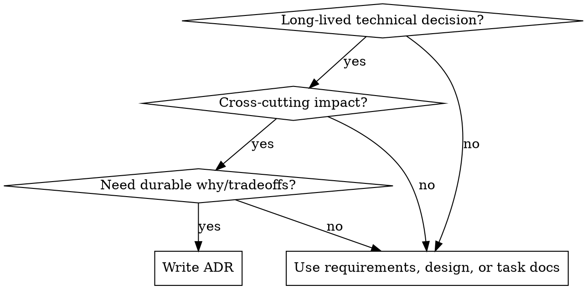

# Writing ADRs

## Overview

Write Architecture Decision Records for durable technical decisions. Keep them focused on the decision, why it was made, what alternatives were considered, and what consequences follow.

In this repo, prefer ADRs over requirements notes or change plans when the choice is long-lived, cross-cutting, and likely to matter after the current task is finished.

## When to Use



Use for:

- API boundary decisions
- database or schema strategy
- infrastructure and deployment conventions
- framework or library choices that affect multiple packages
- cross-cutting coding or architectural conventions
- replacing or deprecating an earlier architectural decision

Do not use for:

- one-off implementation details
- task breakdowns or rollout checklists
- feature requirements that are still fluid
- local refactors with no durable policy impact

## Repo Convention Detection

Before drafting, inspect the repo in this order:

1. Look for existing ADR locations: `docs/adr`, `docs/adrs`, `adr`, `adrs`.
2. Look for templates or prior records: `ADR-*`, `*-adr-template.md`, `000-adr-template.md`.
3. Mirror the existing convention if found: path, numbering, headings, language, metadata, and status terms.
4. If nothing exists, use this repo default:
   - Directory: `docs/adr/`
   - File name: `NNN-short-kebab-case.md`
   - Numbering: 3 digits, zero-padded (`001`, `002`, ...)
   - Title line: `# ADR-NNN: Short title`
   - Language: use the repo's dominant docs language; in this repo, default to Japanese

Do not invent a new ADR format if the repo already has one.

## Quick Reference

| Situation                                | Use ADR? | Notes                                  |
| ---------------------------------------- | -------- | -------------------------------------- |
| Stable API boundary between packages     | Yes      | Record rationale and enforcement rules |
| Database engine or schema strategy       | Yes      | Include rejected alternatives          |
| New feature scope or acceptance criteria | No       | Use requirements or change docs        |
| Implementation steps for approved work   | No       | Use tasks or design docs               |
| Replacing an old architecture decision   | Yes      | Create new ADR and update old status   |

## Default ADR Skeleton

If the repo has no stronger convention, use this compact structure:

```markdown
# ADR-001: Short title

## Status

Proposed

## Context

- What problem exists now?
- What constraints matter?
- Why does this need a durable decision?

## Decision

State the chosen approach in one clear paragraph.

## Considered Options

### Option A - Chosen approach

- Why it fits

### Option B - Rejected approach

- Why it was not chosen

## Consequences

- Positive outcomes
- Negative outcomes
- Migration or enforcement implications

## Related ADRs / Follow-up

- Supersedes: ADR-000
- Follow-up work or policy checks
```

Minimum bar:

- one clear decision
- at least one considered alternative
- concrete consequences, not only benefits
- enough context that a future reader can understand why the choice was made

## Lifecycle Rules

When revisiting a prior decision:

- create a new ADR for the new decision
- update the old ADR status if the old file exists
- use `Deprecated` when the old decision is no longer recommended
- use `Superseded by ADR-NNN` when a new ADR replaces the old one directly
- cross-link both records

When repo conventions are absent:

- do not bury ADRs in `docs/requirements/`
- do not put durable decisions only inside `openspec/changes/...`
- create `docs/adr/` and continue numbering from the highest existing ADR number

## Example

Decision: establish `@ms/api` and tRPC as the only stable web-to-backend boundary.

Good ADR shape:

- context explains why direct imports from `apps/api/src/*` create tight coupling
- decision states that `apps/web` depends on `@ms/api` types and tRPC contracts only
- considered options compare direct internal imports, REST wrappers, and the chosen boundary
- consequences include stronger separation, added contract maintenance, and migration checks

## Common Mistakes

| Mistake                                                              | Fix                                                             |
| -------------------------------------------------------------------- | --------------------------------------------------------------- |
| Writing a design doc instead of a decision record                    | Center the document on decision, alternatives, and consequences |
| Skipping rejected options because the choice feels obvious           | Add at least one real alternative and why it lost               |
| Using a random docs path                                             | Detect ADR conventions first, otherwise use `docs/adr/`         |
| Creating a replacement ADR without updating the old one              | Mark the old ADR `Deprecated` or `Superseded by ADR-NNN`        |
| Copying the fallback template into a repo that already has ADR rules | Mirror the repo's existing style instead                        |
